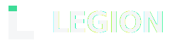
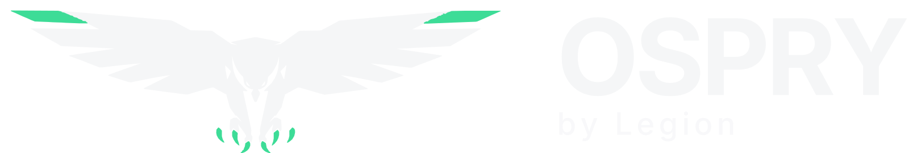

  <picture>
    <source media="(prefers-color-scheme: dark)" srcset="legion-code-inc/logos/legion-logo-dark.svg">
    <source media="(prefers-color-scheme: light)" srcset="legion-code-inc/logos/legion-logo-light.svg">
    
  </picture>

<em>The developer toolchain, for the time of AI.</em>

# Brands

The single source of truth for every mark, color, font, and rule across Legion Code Inc. and its products. If an asset isn't in this repo, it isn't official. Don't pull logos from old decks, screenshots, or Slack. Pull them from here.

| Folder | Brand | What's inside |
|---|---|---|
| [`legion-code-inc/`](legion-code-inc/) | **Legion Code Inc.** (parent company) | Full brand kit: 19 SVG marks, 200+ PNGs, ICOs, Inter + JetBrains Mono fonts, CSS tokens, 34 component preview cards, interactive brand guide |
| [`ospry/`](ospry/) | **OSPRY** (product) | Osprey mark in 5 SVG lockups, 186-file PNG export matrix, favicons, interactive brand guide, 10 public-facing PDFs |
| [`myidentityprovider/`](myidentityprovider/) | **My Identity Provider** | Icon set (SVG + PNG) |

---

## Legion Code Inc.

The parent identity. Dark-native, modern dev-tool minimal, one electric-green accent reserved for verified and signed states. Every Legion product inherits this language.

**Start here:** [`legion-code-inc/brand-guide.html`](legion-code-inc/brand-guide.html) (interactive guide) and [`legion-code-inc/README.md`](legion-code-inc/README.md) (markdown reference).

### Core palette

| Token | Hex | Use |
|---|---|---|
| `brand.primary` | `#3DDC97` | Verified green. Logo accent cap, signed badges, verified states. Nothing else. |
| `bg.canvas` | `#0A0B0D` | Base dark background |
| `bg.surface` | `#13151A` | Sidebars, rails, panels |
| `bg.elevated` | `#1C1F26` | Cards, rows, modals |
| `text.primary` | `#F5F6F7` | Headings, primary body |
| `text.secondary` | `#A1A8B3` | Body copy, descriptions |
| `severity.critical` | `#FF4D5E` | Critical findings |
| `severity.warning` | `#FFB02E` | Warnings |
| `severity.info` | `#5B8AFF` | Informational |

Full token set ships as CSS custom properties in [`legion-code-inc/colors_and_type.css`](legion-code-inc/colors_and_type.css). Drop it into any Legion property and you have the whole system.

**The scarcity rule.** `#3DDC97` appears no more than once per visible region. It's the only loud color in the system and it means one thing: verified. Overuse it and it stops meaning anything. This is the most-violated rule on new surfaces, so audit for it.

### Typography

| Family | Job | Weights |
|---|---|---|
| **Inter** | UI, marketing, headings, body, the wordmark | 400 / 500 / 600 / 700 |
| **JetBrains Mono** | Code, file paths, hashes, line numbers, coordinates | 400 / 500 / 600 |

Both families ship in [`legion-code-inc/fonts/`](legion-code-inc/fonts/). Mono is the texture of trust: if it's evidence, it renders in JetBrains Mono. No exceptions.

### Logo quick picks

| Need | File |
|---|---|
| Lockup on dark | [`logos/legion-logo-dark.svg`](legion-code-inc/logos/legion-logo-dark.svg) |
| Lockup on light / print | [`logos/legion-logo-light.svg`](legion-code-inc/logos/legion-logo-light.svg) |
| Symbol alone (inherits text color) | [`logos/legion-symbol.svg`](legion-code-inc/logos/legion-symbol.svg) |
| Favicon / app icon | [`logos/legion-favicon.svg`](legion-code-inc/logos/legion-favicon.svg) + [`logos/ico/`](legion-code-inc/logos/ico/) |
| PNG at a specific size | [`logos/png/`](legion-code-inc/logos/png/) (16px through 2048px) |

Minimums: symbol 24px, wordmark 80px wide, full lockup 120px wide. Clear space equals the height of the accent cap. Never recolor the cap, never add a shadow or gradient, never place the mark over a photo.

---

## OSPRY

  <picture>
    <source media="(prefers-color-scheme: dark)" srcset="ospry/logos/png/lockup/ospry-v2-horizontal-white-1600.png">
    <source media="(prefers-color-scheme: light)" srcset="ospry/logos/png/lockup/ospry-v2-horizontal-ink-1600.png">
    
  </picture>

**Identity resolution, by Legion.** OSPRY turns anonymous traffic into person- and company-level signal. The name stands for **Observe. Score. Profile. Reach. Yield.**

OSPRY inherits the Legion design language and adds its own signature: verified-green `#3DDC97` on the bird's wing-tips and talons. The body is `currentColor` (white on dark, ink on light); the green is fixed and never recolored.

**Start here:** [`ospry/brand-guide.html`](ospry/brand-guide.html) (interactive kit) and [`ospry/README.md`](ospry/README.md) (full palette and export matrix).

### Signature accents

Green stays reserved for verified and identified. Three additional accents carry everything else, and double as the categorical chart series:

| Name | Hex | Role |
|---|---|---|
| OSPRY Green | `#3DDC97` | Verified / identified, the mark's accents |
| Electric Blue | `#2BA8FF` | Interactive, links, selected, data series 1 |
| Violet | `#9B72FF` | Enrichment, tags, data series 2 |
| Burnt Orange | `#E2683C` | Highlight, attention, data series 3 |

### Logo quick picks

| Need | File |
|---|---|
| Bird only | [`logos/svg/ospry-v2-symbol.svg`](ospry/logos/svg/ospry-v2-symbol.svg) |
| Horizontal lockup (bird + OSPRY / by Legion) | [`logos/svg/ospry-v2-lockup-horizontal.svg`](ospry/logos/svg/ospry-v2-lockup-horizontal.svg) |
| Lockup with tagline | [`logos/svg/ospry-v2-lockup-tagline.svg`](ospry/logos/svg/ospry-v2-lockup-tagline.svg) |
| Stacked lockup | [`logos/svg/ospry-v2-lockup-stacked.svg`](ospry/logos/svg/ospry-v2-lockup-stacked.svg) |
| PNG exports (transparent, square, 16:9, 21:9) | [`logos/png/png-assets/`](ospry/logos/png/png-assets/) |
| Favicon | [`logos/png/png-assets/favicon/`](ospry/logos/png/png-assets/favicon/) |

Dark backgrounds get the white-body bird. Light backgrounds get the ink-body bird. The green stays green on both.

### Public documents

Shareable PDFs live in [`ospry/docs/`](ospry/docs/): product guide, one-pagers (standard, DTC, agency partner kit), trust and privacy brief, market brief, and head-to-head comparisons vs 6sense, RB2B, Vector, and Warmly. Everything in that folder is marked PUBLIC and safe to send.

---

## My Identity Provider

Icon assets only, in [`myidentityprovider/logos/`](myidentityprovider/logos/) (SVG plus PNG exports). No standalone brand guide yet; it follows the Legion design language.

---

## House rules

These apply to every brand in this repo. The full voice spec lives in the Legion brand guide.

- **Voice.** The direct expert next door. Calm, plain, technically literate, never hedging, never preachy. State facts. Never alarm, never moralize.
- **No em dashes.** Use commas, colons, parentheses, periods, or hyphens.
- **No exclamation marks** in product copy. **No emoji** in reports, errors, or technical docs.
- **No forbidden absolutes.** Never "100% secure," "bulletproof," or "unhackable."
- **Casing.** Title Case for product and tier names only. Sentence case for labels and buttons. UPPERCASE only for the wordmark, eyebrow labels, and severity chips.
- **Never celebrate bad results.** "Great news, we found 12 critical issues" is a sentence we never write.

---

*Legion Code Inc. · We are Legion. Vibe with Legion.*
